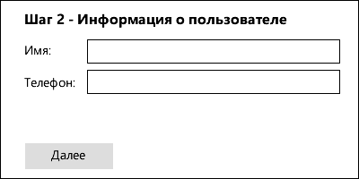
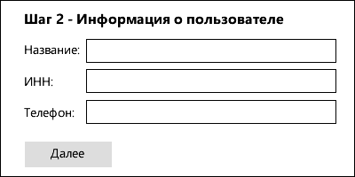
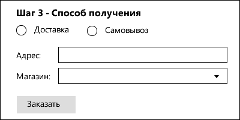

Практическое задание №09
=======================

Создать форму оформления зазаза, состоящую из нескольких шагов.

Все шаги представляют собой отдельные веб-страницы, но генерируются они через один файл `order.php`. Для указания текущего шага должен передаваться GET-параметр `step`: например, `order.php?step=2` - второй шаг

- после заполнения данных на каждом из шагов нужно проверить правильность их ввода на стороне PHP. Если пользователь ввел неверные данные, то его должно вернуть обратно на текущий шаг, в форму которого должны быть подставлены старые введенные данные и отображено сообщение об ошибке
- промежуточные данные храните в [сессии](https://www.php.net/manual/ru/session.examples.basic.php)
- если пользователь пытается перейти на шаг, который ему сейчас недоступен (например, он на шаге 1 и пытается открыть страницу `order.php?step=3`), его должно перенаправить на текущий шаг (используйте функцию `header`, например `header('Location: order.php?step=1')`)
- данные форм должные передавать методом `POST`


**1) Шаг 1:**


Проверить, что:
- выбран один из типов: физическое лицо или юридическое лицо

**2) Шаг 2:**

**2а)** Если на первом шаге был выбран тип "Физическое лицо"



Проверить, что:
- имя не пустое
- телефон после удаления всех не цифр состоит из 11 символов (удалите прочие символы, с помощью [preg_replace](https://www.php.net/manual/ru/function.preg-replace.php))

**2б)** Если на первом шаге был выбран тип "Юридическое лицо"



Проверить, что:
- название не пустое
- ИНН состоит из 10 или 12 цифр
- телефон не пустой

**3) Шаг 3:**



На этой форме должен присутсвовать JS-код, который изначально скрывает поля "Адрес" и "Магазин". Если выбран пункт "Доставка", то должно отобразиться поле "Адрес", а если выбран пункт "Самовывоз", то - "Магазин"

Проверить, что:
- если тип "Доставка", то поле "Адрес" не пустое
- если тип "Самовывоз", то поле "Магазин" содержит один из след. магаин (проверяйте по id):
```
$shops = [
  [ 'id' => 1, 'Пушкинская, 42' ],
  [ 'id' => 2, 'Карла Маркса, 314' ],
  [ 'id' => 3, 'Максима Горького, 404' ],
]
```

**4) Финальная страница**


Должна показывать все введенные данные на предыдущих шагах
